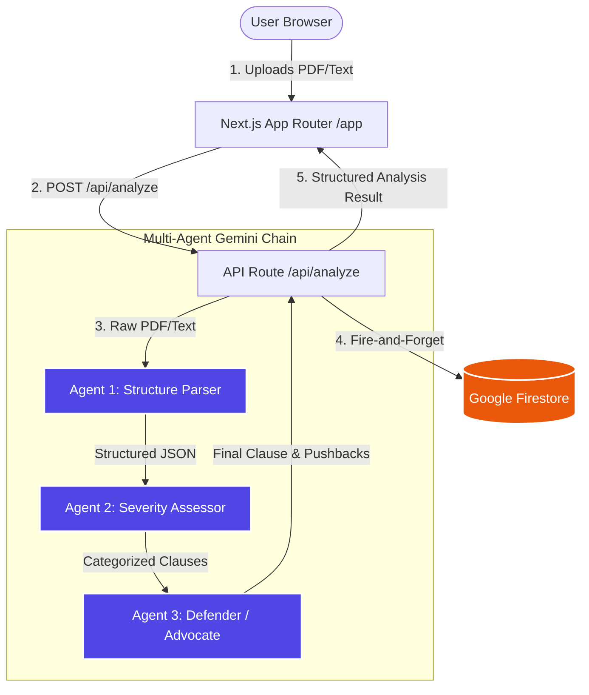

# 🛡️ LexGuard — Multi-Agent AI Contract Intelligence

> **"Every contract is written by their lawyer. This is yours."**
> 
> Built for the **Google × Scaler PromptWars 2026** (Problem Statement 01).
> A state-of-the-art legal intelligence platform that breaks down complex contracts, exposes hidden risks, and equips you with custom-tailored pushback scripts.

---

## 📖 Executive Summary (Non-Technical)

### The Problem
When you sign an NDA, employment agreement, or SaaS Terms of Service, you are signing a document drafted by **their** legal team to protect **their** interests. Hiring a lawyer costs upwards of $300/hour, leaving individuals and small businesses to sign high-risk agreements blindly.

### The Solution
**LexGuard** levels the playing field. In under 30 seconds, it parses any contract, identifies hidden liabilities, and generates a comprehensive defence strategy. 

```
📂 Upload Agreement ──► 🧠 3-Agent Gemini Chain ──► 📊 Interactive Risk Dashboard
(PDF/Text)               (Parser, Assessor, Defender)      (Scores, Audits & Pushbacks)
```

### Key Capabilities
*   ⚡ **Instant PDF Extraction:** Upload raw PDFs or paste plain text. LexGuard immediately digests the entire legal structure.
*   🚦 **Tri-Color Risk Audit:** Clauses are categorized dynamically:
    *   🔴 **HIGH RISK:** Extreme liabilities, indefinite survival, or one-sided waivers.
    *   🟡 **MEDIUM RISK:** Standard clauses with slightly unfavorable terms requiring caution.
    *   🟢 **LOW RISK:** Balanced, standard, or protective clauses.
*   ⚖️ **The Role-Aware Advocate:** Highly customized pushback strategies based on who you are (e.g., an Employee will get different negotiation arguments than an Independent Contractor).
*   📁 **History Vault:** Securely preserves your past contract analyses in a central vault, allowing you to instantly reload, review, and export them at any time.

---

## ⚙️ Core Technical Architecture

LexGuard is built on a high-performance **Next.js 16 (App Router)** frontend containerized via **Docker**, continuously built by **Google Cloud Build**, and served worldwide on **Google Cloud Run**.



### The 3-Stage AI Agent Pipeline
Instead of a single large query, LexGuard breaks the analysis down into three highly specialized serial AI agents powered by **`gemini-2.5-flash`** for surgical precision and maximum speed:

1.  **Agent 1 (The Parser):** Extracts clauses from raw document text or parses Base64 PDF files natively using Gemini's multimodal processing. Standardizes output into a clean, verified structural layout.
2.  **Agent 2 (The Severity Assessor):** Evaluates every extracted clause against a rigorous matrix. It ranks severity (`HIGH`, `MEDIUM`, `LOW`), highlights specific red flags, and details the core legal reasoning behind the rating.
3.  **Agent 3 (The Defender / Advocate):** Triggered dynamically for **HIGH RISK** clauses. It analyzes the user's role (e.g. Employee, Contractor, Founder) and generates:
    *   **What it costs you:** A plain-English explanation of the financial or legal liability.
    *   **Advocate Pushback Script:** An exact, professional statement you can copy-paste to negotiate the clause.
    *   **Proposed Amendment:** Redlined text ready for the modified agreement.

---

## 🛠️ The Technology Stack

| Component | Technology | Google/GCP Services | Purpose |
| --- | --- | --- | --- |
| **Core Framework** | Next.js 16 (App Router) + React 19 | - | High-performance, SEO-optimized, static & dynamic route rendering |
| **Styling Engine** | Tailwind CSS v4 (PostCSS) | - | Zero-runtime CSS utility engine with custom variables |
| **Core Intelligence** | Gemini 2.5 Flash | **Google AI Studio** | Multi-agent reasoning, PDF extraction, and legal synthesis |
| **Database** | Firebase Admin SDK | **Google Cloud Firestore** | Secure serverless storage for analysis logs and history vault |
| **Deployment** | Docker Standalone Container | **Google Cloud Run** | Zero-scaling serverless edge hosting |
| **CI/CD** | Git Triggers | **Google Cloud Build** | Auto-triggered production build and image compilation on git pushes |
| **Analytics** | GA4 Tracking | **Google Analytics 4** | Product usage tracking and conversion auditing |
| **Quality Control** | Jest + ts-jest | - | Automated unit testing suites for core parsing logic |

---

## 📁 Repository Structure

```text
lexguard-landing/
├── app/
│   ├── page.tsx                  # / — Landing Page (Marketing, features & Waitlist)
│   ├── layout.tsx                # Root layout, fonts, and Google Analytics 4
│   ├── globals.css               # Premium design tokens, animations, grids
│   ├── app/
│   │   ├── page.tsx              # /app — The interactive client dashboard tool
│   │   └── layout.tsx            # Full-height dashboard wrapper layout
│   └── api/
│       ├── analyze/
│       │   └── route.ts          # Server-side 3-Agent Gemini analysis pipeline
│       └── gemini/
│           └── route.ts          # Secure client proxy for manual Gemini queries
│
├── components/
│   ├── hero.tsx                  # Landing page blocks & waitlist module
│   ├── problem.tsx
│   ├── product-preview.tsx
│   └── tool/
│       ├── sidebar.tsx           # Dashboard sidebar, profile display & history loader
│       ├── user-onboarding.tsx   # Local storage user profile initializer
│       ├── upload-panel.tsx      # Text paste/drag-and-drop PDF upload component
│       ├── loading-screen.tsx    # Multi-agent simulated loading timers
│       ├── dashboard.tsx         # The main visual analysis dashboard UI
│       ├── clause-card.tsx       # Expandable clause cards with pushback copy utility
│       └── risk-summary.tsx      # Metrics header (Risk score, high/medium/low counts)
│
├── lib/
│   ├── types.ts                  # Shared strict TypeScript schemas
│   ├── gemini.ts                 # Secure server-side Gemini client
│   ├── firebase.ts               # Firebase App & Firestore Admin initializer
│   ├── history.ts                # Firestore CRUD (saveAnalysis, getUserHistory)
│   ├── risk-score.ts             # Mathematical risk-index grading algorithm
│   └── agents/
│       ├── parser.ts             # Agent 1 rules, prompt templates & validation
│       ├── analyzer.ts           # Agent 2 rules, prompt templates & validation
│       └── advocate.ts           # Agent 3 rules, prompt templates & validation
│
├── __tests__/                    # Automated Jest test suites
│   ├── agents-parser.test.ts     # Tests parser model boundaries
│   └── risk-score.test.ts        # Validates math engines for risk index scoring
│
├── Dockerfile                    # Multi-stage production Node 20 runner
├── next.config.ts                # Standalone compilation output configurator
└── package.json                  # Dependencies & task scripts
```

---

## 🚀 Getting Started Locally

### Prerequisites
*   Node.js v20.9.0 or higher (Strict requirement for Next.js 15/16)
*   A Gemini API Key (Grab one instantly from [Google AI Studio](https://aistudio.google.com/))

### Step-by-Step Installation

1.  **Clone the repository:**
    ```bash
    git clone https://github.com/MrCyberNaut/LexGuard.git
    cd LexGuard/lexguard-landing
    ```

2.  **Configure environment variables:**
    Create a `.env.local` file inside the `lexguard-landing/` directory:
    ```bash
    # lexguard-landing/.env.local
    GEMINI_API_KEY=YOUR_GEMINI_API_KEY_HERE
    
    # Optional - Required if using Firestore History Vault
    FIREBASE_SERVICE_ACCOUNT_KEY={"type":"service_account",...}
    ```

3.  **Install dependencies:**
    ```bash
    npm install
    ```

4.  **Run the local development server:**
    ```bash
    npm run dev
    ```

5.  **Open in your browser:**
    *   Landing & Waitlist: `http://localhost:3000`
    *   Interactive App: `http://localhost:3000/app`

---

## 🧪 Automated Testing Suite

To ensure absolute precision when dealing with legal logic, LexGuard includes a comprehensive test suite to validate the integrity of our parsing engines and mathematical risk scorings.

To execute the test suites locally, run:
```bash
npm run test
```

---

## 🌐 Production Deployment Guide (GCP Cloud Run)

This repository is optimized to build inside a secure, lightweight **Docker container** and run on **Google Cloud Run** using continuous integration through **Google Cloud Build**.

### 1. Build Pipeline (Cloud Build)
Cloud Build is configured with a Git trigger that fires on every push to the `main` branch:
1.  Pulls the latest code.
2.  Compiles using a multi-stage **Node 20 Alpine** image.
3.  Optimizes the output size using Next.js standalone file-tracing.
4.  Pushes the compiled image to the **GCP Artifact Registry**.

### 2. Live Hosting (Cloud Run)
The container is deployed serverlessly in `europe-west1` (Belgium):
*   **Port:** 8080 (Mapped dynamically to Next.js host 3000)
*   **Scale:** Automatically scales down to 0 instances when inactive (maximizing resource efficiency).
*   **Environment Variables:** Configured securely in the GCP Console under the Variables tab (`GEMINI_API_KEY`).

### 3. Database Sync (Firestore)
When deployed on Cloud Run, the system automatically uses its native service account credentials to authenticate securely with **Google Cloud Firestore**. No local keys or passwords need to be committed to Git!

---

## 🎨 Premium UI & Design Tokens

LexGuard uses a bespoke **Deep Dark UI theme ("Void Theme")** constructed directly within vanilla CSS variables inside `globals.css`. 

```css
:root {
  --ink: #0e0e0e;         /* Pure dark, used in light overlays */
  --paper: #f5f4f0;       /* Warm-toned premium white */
  --void: #080808;        /* Pure void, tool background */
  --void-2: #111110;      /* Sidebar and secondary containers */
  --void-3: #1c1c1a;      /* Raised card surfaces */
  --accent: #5b48e8;      /* Electric purple primary indicator */
  
  --risk-red: #d93a2b;    /* High risk alert badge */
  --risk-amber: #c47a16;  /* Warning state */
  --risk-green: #1a7a4a;  /* Checked & safe state */
}
```
The interface is designed with:
*   🌌 **Glassmorphism panels** with subtle `rgba` border overlays.
*   📐 **Blueprint layout grids** matching high-fidelity engineering draft schematics.
*   📈 **Micro-animations** for transitions, agent load cycles, and hover states.

---

## 🛡️ License & Credit
Created under Problem Statement 01 by the LexGuard team for Google × Scaler PromptWars 2026. All code and methodologies represent modern engineering best-practices.
